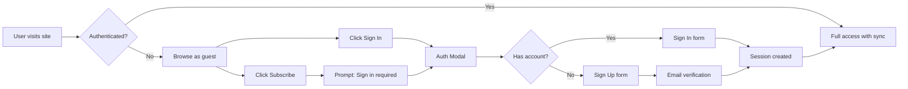
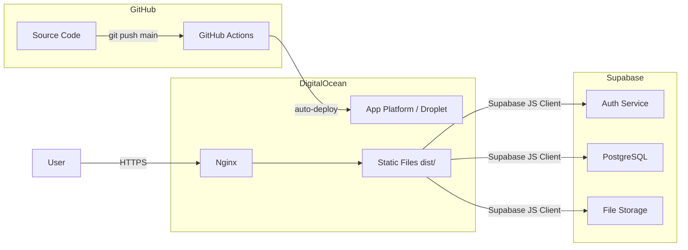
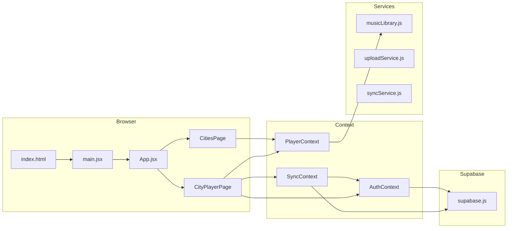
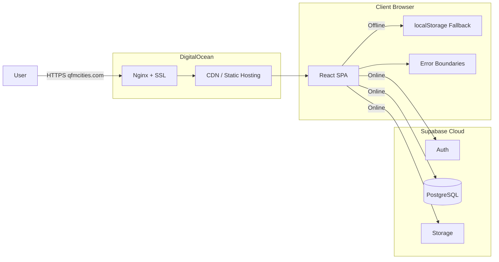
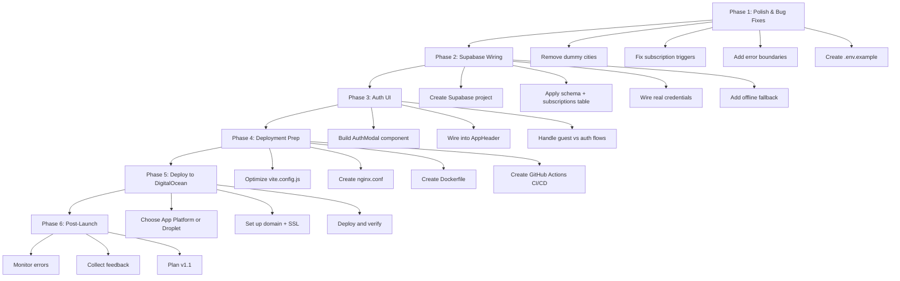

# Q-FM Cities — Beta v1.0 Completion & DigitalOcean Deployment Plan

**Date:** 2026-07-18  
**Project:** `q-fm-cities-com`  
**Author:** Roo (Architect)

---

## Table of Contents

1. [Current State Assessment](#1-current-state-assessment)
2. [Beta v1.0 Definition](#2-beta-v10-definition)
3. [Phase 1: Polish & Bug Fixes](#3-phase-1-polish--bug-fixes)
4. [Phase 2: Supabase Wiring](#4-phase-2-supabase-wiring)
5. [Phase 3: Auth UI & User Flows](#5-phase-3-auth-ui--user-flows)
6. [Phase 4: Deployment Prep](#6-phase-4-deployment-prep)
7. [Phase 5: DigitalOcean Deployment](#7-phase-5-digitalocean-deployment)
8. [Phase 6: Post-Launch](#8-phase-6-post-launch)
9. [Architecture Diagrams](#9-architecture-diagrams)
10. [Risk Register](#10-risk-register)

---

## 1. Current State Assessment

### What's Working ✅

| Area | Status | Details |
|------|--------|---------|
| Music Player | ✅ Complete | Play, pause, skip, shuffle, repeat, volume, progress bar |
| City Grid | ✅ Complete | Auto-discovers music folders as cities |
| Routing | ✅ Complete | React Router v7, `/` and `/city/:cityId` |
| CSS Architecture | ✅ Complete | 10 modular stylesheets in `src/styles/` |
| Component Decomposition | ✅ Complete | Player, playlist, layout, effects all separated |
| Code Splitting | ✅ Complete | `lazy()` on CitiesPage and CityPlayerPage |
| Supabase Schema | ✅ Complete | 3 tables with RLS, ready to apply |
| Auth Context | ✅ Complete | `signIn`, `signUp`, `signOut`, session management |
| Sync Context | ✅ Complete | Favorites, playlists CRUD, upload orchestration |
| Subscription UI | ✅ Complete | Free/Monthly/Yearly/Lifetime with FakePayPal |

### What's Missing / Broken ❌

| Area | Status | Details |
|------|--------|---------|
| Supabase Connection | ❌ Missing | `.env` file not committed; placeholder credentials in `supabase.js` |
| Auth UI | ❌ Missing | No login/signup forms — `AuthContext` exists but no UI to use it |
| Offline Fallback | ❌ Missing | App crashes or shows warnings when Supabase is unreachable |
| Dummy Cities | ❌ Broken | 4 fake cities injected unconditionally, polluting the grid |
| Subscription Triggers | ❌ Bug | Known issue with subscription state persistence |
| Error Boundaries | ❌ Missing | No React error boundaries anywhere |
| `.env` Files | ❌ Missing | No `.env`, `.env.production`, or `.env.example` |
| Deployment Config | ❌ Missing | No Dockerfile, nginx config, or App Platform spec |
| CI/CD | ❌ Missing | No GitHub Actions or deployment pipeline |
| Analytics | ❌ Missing | No usage tracking or monitoring |
| SEO / Meta Tags | ❌ Missing | No meta description, OG tags, favicon |
| PWA Support | ❌ Missing | No service worker or manifest |
| Tests | ⚠️ Partial | 6 test files exist but coverage is minimal |

---

## 2. Beta v1.0 Definition

**Beta v1.0 = A publicly accessible, working music player with cloud sync for authenticated users.**

### Must-Have (Ship Blockers)

- [ ] Supabase connected with real credentials
- [ ] Auth UI (login/signup) so users can create accounts
- [ ] Graceful offline fallback when Supabase is unavailable
- [ ] Dummy cities removed or hidden behind a flag
- [ ] Deployed to DigitalOcean and publicly accessible
- [ ] Custom domain or DO-assigned URL
- [ ] HTTPS working

### Nice-to-Have (Ship with v1.1)

- [ ] PWA support (offline listening)
- [ ] Analytics
- [ ] SEO tags
- [ ] Payment integration (real Stripe instead of FakePayPal)
- [ ] Admin upload UI
- [ ] Email verification flows

---

## 3. Phase 1: Polish & Bug Fixes

### 3.1 Remove Dummy Cities

**File:** [`src/services/musicLibrary.js`](src/services/musicLibrary.js:75)

The `addDummyCities()` function injects 4 fake cities unconditionally. For Beta, either:
- Remove the function entirely, OR
- Gate it behind `import.meta.env.DEV` so it only shows in development

```js
// Option B — dev-only dummies
const cities = import.meta.env.DEV ? addDummyCities(realCities) : realCities
```

### 3.2 Fix Subscription Triggers

**Files:** [`src/components/SubscriptionPage.jsx`](src/components/SubscriptionPage.jsx:1), [`src/App.jsx`](src/App.jsx:1)

Known issue with subscription state. The current implementation uses `localStorage` only — no server-side verification. For Beta:
- Keep localStorage for now (it works for demo)
- Add a `subscriptions` table to Supabase schema
- Wire subscription status to Supabase for authenticated users
- Fall back to localStorage when offline

### 3.3 Add Error Boundaries

Create [`src/components/ErrorBoundary.jsx`](src/components/ErrorBoundary.jsx):

```jsx
class ErrorBoundary extends React.Component {
  state = { hasError: false, error: null }
  static getDerivedStateFromError(error) {
    return { hasError: true, error }
  }
  render() {
    if (this.state.hasError) {
      return <div className="error-screen">
        <h2>Something went wrong</h2>
        <p>{this.state.error.message}</p>
        <button onClick={() => this.setState({ hasError: false })}>
          Try Again
        </button>
      </div>
    }
    return this.props.children
  }
}
```

Wrap at minimum: `CitiesPage`, `CityPlayerPage`, and the root `App`.

### 3.4 Add `.env.example`

Create [`.env.example`](.env.example):

```bash
VITE_SUPABASE_URL=https://your-project.supabase.co
VITE_SUPABASE_ANON_KEY=your-anon-key-here
```

---

## 4. Phase 2: Supabase Wiring

### 4.1 Create Supabase Project

1. Go to [supabase.com](https://supabase.com) and create a new project
2. Copy the project URL and anon key
3. Create `.env` locally:

```bash
VITE_SUPABASE_URL=https://xxxxx.supabase.co
VITE_SUPABASE_ANON_KEY=eyJhbGciOiJIUzI1NiIs...
```

### 4.2 Apply Schema

Run [`supabase/schema.sql`](supabase/schema.sql:1) in the Supabase SQL Editor to create:
- `public.favorites` — user favorite tracks
- `public.playlists` — user playlists
- `public.playlist_tracks` — tracks within playlists
- All RLS policies

### 4.3 Add Subscriptions Table

Add to schema:

```sql
CREATE TABLE IF NOT EXISTS public.subscriptions (
  id UUID PRIMARY KEY DEFAULT uuid_generate_v4(),
  user_id UUID NOT NULL REFERENCES auth.users(id) ON DELETE CASCADE,
  plan_id TEXT NOT NULL,
  status TEXT NOT NULL DEFAULT 'active',
  created_at TIMESTAMPTZ DEFAULT NOW(),
  expires_at TIMESTAMPTZ,
  UNIQUE(user_id)
);

ALTER TABLE public.subscriptions ENABLE ROW LEVEL SECURITY;

CREATE POLICY "Users can view own subscription" ON public.subscriptions
  FOR SELECT USING (auth.uid() = user_id);
```

### 4.4 Wire Supabase Client

Update [`src/lib/supabase.js`](src/lib/supabase.js:1) to:
- Remove placeholder credentials
- Add better error logging
- Add connection health check

```js
export async function checkSupabaseConnection() {
  try {
    const { error } = await supabase.from('favorites').select('id').limit(1)
    return !error
  } catch {
    return false
  }
}
```

### 4.5 Graceful Offline Fallback

Update [`src/context/SyncContext.jsx`](src/context/SyncContext.jsx:1) to:
- Detect when Supabase is unreachable
- Fall back to localStorage for favorites and playlists
- Show a toast: "Cloud sync unavailable — changes saved locally"
- Queue changes for sync when connection restores

---

## 5. Phase 3: Auth UI & User Flows

### 5.1 Auth Modal Component

Create [`src/components/auth/AuthModal.jsx`](src/components/auth/AuthModal.jsx):

- Email/password login form
- Email/password signup form
- Toggle between login/signup
- "Continue as guest" option
- Error display for invalid credentials
- Loading state during auth operations

### 5.2 Wire Auth into App

- Add "Sign In" button to [`AppHeader`](src/components/layout/AppHeader.jsx:1)
- Show user avatar/email when authenticated
- Add sign-out button
- Show auth modal on sign-in click

### 5.3 Auth Flow Diagram



---

## 6. Phase 4: Deployment Prep

### 6.1 Production Build Config

Update [`vite.config.js`](vite.config.js:1):

```js
export default defineConfig({
  plugins: [react()],
  build: {
    outDir: 'dist',
    sourcemap: false,
    minify: 'terser',
    rollupOptions: {
      output: {
        manualChunks: {
          vendor: ['react', 'react-dom', 'react-router-dom'],
          supabase: ['@supabase/supabase-js'],
        },
      },
    },
  },
})
```

### 6.2 Nginx Config for SPA

Create [`nginx.conf`](nginx.conf):

```nginx
server {
    listen 80;
    server_name qfmcities.com www.qfmcities.com;
    root /var/www/q-fm-cities/dist;
    index index.html;

    # Gzip
    gzip on;
    gzip_types text/css application/javascript image/svg+xml;
    gzip_min_length 256;

    # SPA routing — serve index.html for all non-file routes
    location / {
        try_files $uri $uri/ /index.html;
    }

    # Cache static assets
    location /assets/ {
        expires 1y;
        add_header Cache-Control "public, immutable";
    }

    # Security headers
    add_header X-Frame-Options "SAMEORIGIN";
    add_header X-Content-Type-Options "nosniff";
    add_header Referrer-Policy "strict-origin-when-cross-origin";
}
```

### 6.3 Dockerfile

Create [`Dockerfile`](Dockerfile):

```dockerfile
FROM node:20-alpine AS builder
WORKDIR /app
COPY package*.json ./
RUN npm ci
COPY . .
RUN npm run build

FROM nginx:alpine
COPY nginx.conf /etc/nginx/conf.d/default.conf
COPY --from=builder /app/dist /var/www/q-fm-cities/dist
EXPOSE 80
CMD ["nginx", "-g", "daemon off;"]
```

### 6.4 GitHub Actions CI/CD

Create [`.github/workflows/deploy.yml`](.github/workflows/deploy.yml):

```yaml
name: Deploy to DigitalOcean

on:
  push:
    branches: [main]

jobs:
  deploy:
    runs-on: ubuntu-latest
    steps:
      - uses: actions/checkout@v4

      - name: Build Docker image
        run: docker build -t qfm-cities .

      - name: Save and transfer image
        run: |
          docker save qfm-cities | gzip > qfm-cities.tar.gz
          scp qfm-cities.tar.gz deploy@${{ secrets.DO_HOST }}:/tmp/

      - name: Deploy on server
        run: |
          ssh deploy@${{ secrets.DO_HOST }} '
            docker load < /tmp/qfm-cities.tar.gz
            docker stop qfm-cities || true
            docker rm qfm-cities || true
            docker run -d --name qfm-cities -p 80:80 qfm-cities
          '
```

### 6.5 Environment Variables for Production

Create `.env.production` template:

```bash
VITE_SUPABASE_URL=__SUPABASE_URL__
VITE_SUPABASE_ANON_KEY=__SUPABASE_ANON_KEY__
```

These get injected at build time via GitHub Actions secrets.

---

## 7. Phase 5: DigitalOcean Deployment

### 7.1 Option A: DigitalOcean App Platform (Simplest)

**Best for: Zero-ops, auto-deploys from GitHub, managed HTTPS**

1. Go to [cloud.digitalocean.com](https://cloud.digitalocean.com) → Apps → Create App
2. Connect your GitHub repo
3. Select the `main` branch
4. Choose **Static Site** as the resource type
5. Configure:
   - **Build Command:** `npm ci && npm run build`
   - **Output Directory:** `dist`
   - **HTTP Port:** Not needed for static sites
   - **Environment Variables:** Add `VITE_SUPABASE_URL` and `VITE_SUPABASE_ANON_KEY`
6. Choose a plan: **Starter ($5/mo)** is sufficient for Beta
7. Deploy

**Pros:** Free SSL, auto-deploy on push, no server management  
**Cons:** No server-side logic possible (fine for a pure SPA)

### 7.2 Option B: DigitalOcean Droplet (More Control)

**Best for: Full control, Docker, future backend services**

1. Create a $6/mo Droplet (1GB RAM, 1 CPU, 25GB SSD) with Docker pre-installed
2. Point your domain's A record to the Droplet IP
3. SSH in and set up:

```bash
# Clone the repo
git clone https://github.com/your-org/q-fm-cities-com.git /opt/q-fm-cities
cd /opt/q-fm-cities

# Create .env with production values
echo "VITE_SUPABASE_URL=..." >> .env
echo "VITE_SUPABASE_ANON_KEY=..." >> .env

# Build and run with Docker
docker build -t qfm-cities .
docker run -d --name qfm-cities -p 80:80 qfm-cities

# Set up SSL with Certbot
apt install certbot python3-certbot-nginx
certbot --nginx -d qfmcities.com -d www.qfmcities.com
```

4. Set up GitHub Actions for automated deploys (see 6.4)

### 7.3 Domain & SSL

- Purchase domain (e.g., `qfmcities.com`) from Namecheap or similar
- Point DNS to DigitalOcean nameservers
- For App Platform: SSL is automatic
- For Droplet: Use Certbot for Let's Encrypt

### 7.4 Deployment Architecture



---

## 8. Phase 6: Post-Launch

### 8.1 Monitoring

- **Uptime:** DigitalOcean App Platform includes built-in health checks
- **Errors:** Add `window.onerror` logging to console for now
- **Analytics:** Consider Plausible or Umami (self-hosted, privacy-friendly)

### 8.2 Beta Feedback Loop

- Add a simple feedback form or mailto link
- Monitor Supabase logs for auth errors
- Track which cities/tracks are most played (via Supabase analytics)

### 8.3 v1.1 Roadmap Ideas

- PWA: Add `manifest.json` and service worker for offline playback
- Real payments: Stripe integration replacing FakePayPal
- Admin dashboard: Upload new music via the browser
- Social features: Share playlists, follow users
- Mobile apps: Wrap with Capacitor or Tauri

---

## 9. Architecture Diagrams

### 9.1 Current Data Flow



### 9.2 Target Beta v1.0 Architecture



---

## 10. Risk Register

| Risk | Likelihood | Impact | Mitigation |
|------|-----------|--------|------------|
| Supabase project deleted or rate-limited | Low | High | Keep `.env` backup, use fallback mode |
| Domain expires or DNS misconfigured | Low | High | Set auto-renew, test DNS before launch |
| Music files too large for initial load | Medium | Medium | Lazy load tracks, add loading skeletons |
| Auth flow broken on mobile | Medium | Medium | Test on mobile viewports before launch |
| DigitalOcean bill unexpectedly high | Low | Low | Set billing alerts, use $5-6/mo tier |
| CORS issues with Supabase | Low | Medium | Configure Supabase allowed origins |
| Git LFS not supported on DO App Platform | Medium | High | Use Droplet with Docker instead |

---

## Summary: Execution Order



---

**Ready for review.** What do you think of this plan? I'd recommend starting with Phase 1 (polish) and Phase 2 (Supabase wiring) as the critical path to a working Beta.
