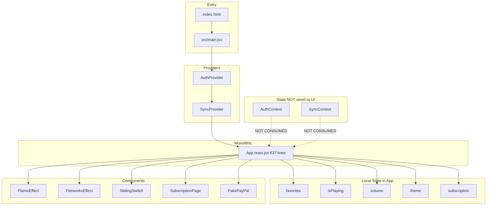
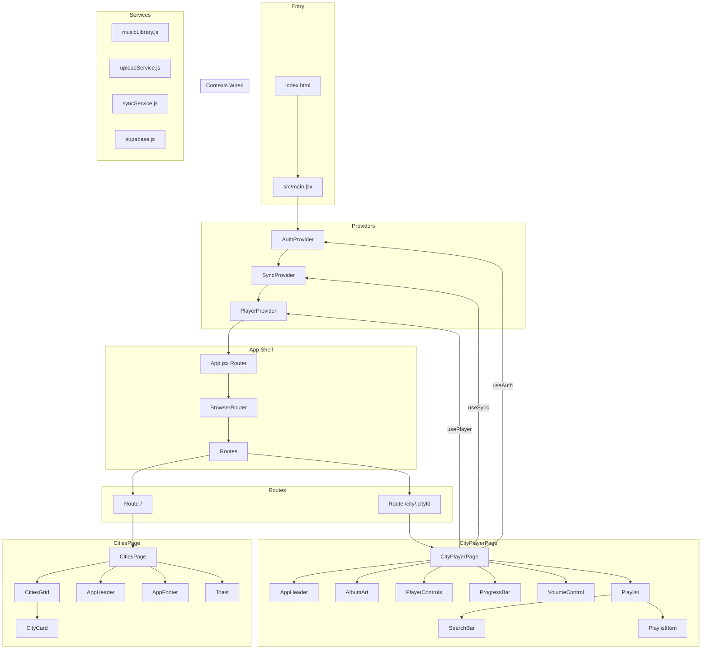
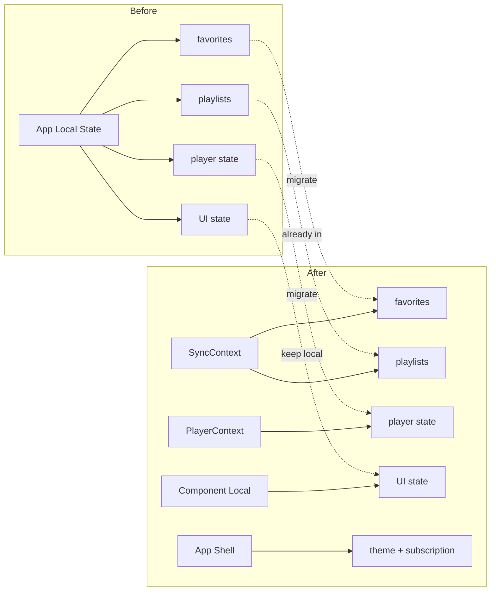

# Q-FM Cities — Complete Refactor Plan

**Date:** 2026-07-16  
**Project:** `q-fm-cities-com`  
**Author:** Roo (Architect)

---

## Table of Contents

1. [Executive Summary](#1-executive-summary)
2. [Current Architecture Analysis](#2-current-architecture-analysis)
3. [Issues & Pain Points](#3-issues--pain-points)
4. [Target Architecture](#4-target-architecture)
5. [Refactor Phases](#5-refactor-phases)
6. [Phase 1: Project Structure & Foundation](#6-phase-1-project-structure--foundation)
7. [Phase 2: Component Decomposition](#7-phase-2-component-decomposition)
8. [Phase 3: State Management & Context Wiring](#8-phase-3-state-management--context-wiring)
9. [Phase 4: Routing & Navigation](#9-phase-4-routing--navigation)
10. [Phase 5: CSS Architecture](#10-phase-5-css-architecture)
11. [Phase 6: Supabase Integration](#11-phase-6-supabase-integration)
12. [Phase 7: Testing & Quality](#12-phase-7-testing--quality)
13. [Phase 8: Performance & Polish](#13-phase-8-performance--polish)
14. [File-by-File Migration Guide](#14-file-by-file-migration-guide)
15. [Risk Assessment & Rollback Plan](#15-risk-assessment--rollback-plan)

---

## 1. Executive Summary

This document outlines a complete architectural refactor of the Q-FM Cities music player application. The current codebase is a **functional but monolithic** React 18 + Vite 5 application with 637 lines of UI logic in a single component (`react.jsx`), a 2288-line CSS file, and a fully built but **unwired** Supabase backend.

### Goals

| Goal | Priority | Effort |
|------|----------|--------|
| Decompose monolithic App into focused components | 🔴 High | Large |
| Wire AuthContext + SyncContext into the UI | 🔴 High | Medium |
| Move `react.jsx` into `src/` and establish proper structure | 🔴 High | Small |
| Split 2288-line CSS into modular stylesheets | 🟡 Medium | Medium |
| Add React Router for navigation | 🟡 Medium | Medium |
| Remove dummy cities (or make them opt-in) | 🟡 Medium | Small |
| Add TypeScript for type safety | 🟢 Low | Large |
| Add testing infrastructure | 🟢 Low | Medium |
| Performance optimizations (code splitting, lazy loading) | 🟢 Low | Medium |

### Key Principles

- **Incremental refactoring** — each phase is independently deployable
- **No regressions** — existing functionality must work at every step
- **Feature parity** — the refactored app behaves identically to the current one
- **Progressive enhancement** — TypeScript and tests can be added gradually

---

## 2. Current Architecture Analysis

### 2.1 File Structure

```
/ (root)
├── index.html                          # Entry point
├── react.jsx                           # 637-line MONOLITHIC App component
├── style.css                           # 2288-line MONOLITHIC stylesheet
├── vite.config.js                      # Vite config (minimal)
├── package.json                        # Dependencies
├── src/
│   ├── main.jsx                        # ReactDOM.createRoot + providers
│   ├── lib/
│   │   └── supabase.js                 # Supabase client (placeholder creds)
│   ├── context/
│   │   ├── AuthContext.jsx             # Auth provider (NOT consumed by App)
│   │   └── SyncContext.jsx             # Sync provider (NOT consumed by App)
│   ├── services/
│   │   ├── uploadService.js            # Supabase Storage operations
│   │   └── syncService.js              # Library metadata + user data sync
│   └── components/
│       ├── FlameEffect.jsx             # Flame animation wrapper
│       ├── FireworksEffect.jsx         # Canvas-based fireworks
│       ├── SlidingSwitch.jsx           # Theme cycler button
│       ├── SubscriptionPage.jsx        # Subscription plan picker
│       └── FakePayPal.jsx              # Fake payment flow
├── supabase/
│   └── schema.sql                      # DB schema + RLS policies
├── music/                              # Audio files (Git LFS)
├── plans/                              # Documentation
└── weather in Victoria, BC.png         # Cover art (single image for all cities)
```

### 2.2 Data Flow

```
index.html
    └─▶ src/main.jsx
            ├─▶ AuthProvider (Supabase auth)
            │     └─▶ SyncProvider (favorites, playlists, uploads)
            │           └─▶ App (react.jsx)
            │                 ├─▶ Cities Grid View (conditional render)
            │                 │     ├─▶ FlameEffect
            │                 │     ├─▶ FireworksEffect
            │                 │     ├─▶ SlidingSwitch
            │                 │     ├─▶ City Cards (mapped inline)
            │                 │     └─▶ SubscriptionPage (modal)
            │                 └─▶ City Player View (conditional render)
            │                       ├─▶ FlameEffect
            │                       ├─▶ SlidingSwitch
            │                       ├─▶ Album Art + Progress + Controls
            │                       ├─▶ Playlist (mapped inline)
            │                       └─▶ SubscriptionPage (modal)
            │
            App manages its OWN state:
              ├─▶ selectedCityIndex, currentTrackIndex, isPlaying
              ├─▶ volume, search, toast, currentTime
              ├─▶ isShuffled, repeatMode, favorites (LOCAL)
              ├─▶ visibleCount, expandedImage, activeTheme
              └─▶ showSubscription, isSubscribed, subscribedPlan
```

### 2.3 State Ownership

| State | Owner | Supabase Backed? | Notes |
|-------|-------|-----------------|-------|
| `favorites` | App (local `useState`) | ❌ No | SyncContext has full CRUD but unused |
| `playlists` | SyncContext | ✅ Yes | Only context actually wired to Supabase |
| `user` | AuthContext | ✅ Yes | Not consumed by App at all |
| `syncStatus` | SyncContext | N/A | Not consumed by App |
| `uploadProgress` | SyncContext | N/A | Not consumed by App |
| `isSubscribed` | App (localStorage) | ❌ No | Purely cosmetic/local |
| `activeTheme` | App (localStorage) | ❌ No | Purely cosmetic/local |

---

## 3. Issues & Pain Points

### 🔴 Critical

| # | Issue | Location | Impact |
|---|-------|----------|--------|
| 1 | **Monolithic App component** — 637 lines, all UI + logic + state in one file | `react.jsx` | Impossible to maintain, test, or reason about |
| 2 | **AuthContext + SyncContext not consumed** — fully built cloud infrastructure is dead code | `react.jsx` | User data never syncs; cloud features don't work |
| 3 | **App component in root directory** — violates project conventions | `/react.jsx` | Inconsistent with `src/` structure |
| 4 | **Supabase credentials are placeholders** — `your-project.supabase.co` | `src/lib/supabase.js:5` | Cloud features non-functional even if wired |

### 🟡 Medium

| # | Issue | Location | Impact |
|---|-------|----------|--------|
| 5 | **2288-line CSS file** — all styles in one file | `style.css` | Hard to maintain, no separation of concerns |
| 6 | **Dummy cities always injected** — 4 fake cities with placeholder tracks | `react.jsx:78-135` | Pollutes production build with fake data |
| 7 | **No routing** — conditional rendering instead of routes | `react.jsx` | No deep linking, no browser history, no code splitting |
| 8 | **Audio objects created for ALL tracks on load** — `new Audio()` per track | `react.jsx:138-154` | Memory waste, potential performance issue with many tracks |
| 9 | **`@supabase/supabase-js` missing from package.json** | `package.json` | Would fail to install if not already in node_modules |
| 10 | **No error boundaries** — any render error crashes the entire app | Everywhere | Poor UX on errors |
| 11 | **Fake payment system** — FakePayPal simulates real payment flow | `FakePayPal.jsx` | Misleading; could cause confusion |
| 12 | **Single cover art for all cities** — hardcoded path | `react.jsx:65` | All cities show same image |

### 🟢 Low

| # | Issue | Location | Impact |
|---|-------|----------|--------|
| 13 | **No TypeScript** — plain JSX with no type safety | Everywhere | Runtime errors that could be caught at compile time |
| 14 | **No tests** — zero test files exist | Project root | No regression safety net |
| 15 | **No code splitting** — entire app in one bundle | `vite.config.js` | Larger initial load |
| 16 | **No environment validation** — missing env vars fail silently | `src/lib/supabase.js` | Hard to debug configuration issues |
| 17 | **`LightningBolt.jsx` referenced in open tabs but doesn't exist** | VSCode tabs | Dead reference or deleted file |
| 18 | **No PropTypes or JSDoc** — no documentation of component interfaces | Everywhere | Hard for new developers to understand |

---

## 4. Target Architecture

### 4.1 Target File Structure

```
src/
├── main.jsx                              # Entry point (unchanged)
├── App.jsx                               # Router + layout shell (was react.jsx)
├── vite-env.d.ts                         # TypeScript env declarations
│
├── components/
│   ├── layout/
│   │   ├── AppHeader.jsx                 # Logo, title, subscribe button
│   │   ├── AppFooter.jsx                 # Copyright footer
│   │   └── Toast.jsx                     # Toast notification component
│   │
│   ├── cities/
│   │   ├── CitiesGrid.jsx                # Grid of city cards with infinite scroll
│   │   ├── CityCard.jsx                  # Individual city card
│   │   └── CityPlayer.jsx               # Player view for a selected city
│   │
│   ├── player/
│   │   ├── AudioPlayer.jsx              # Audio element + controls wrapper
│   │   ├── PlayerControls.jsx           # Play/pause, prev/next, shuffle, repeat
│   │   ├── ProgressBar.jsx              # Seekable progress bar
│   │   ├── VolumeControl.jsx            # Volume slider
│   │   └── AlbumArt.jsx                 # Cover image with expand
│   │
│   ├── playlist/
│   │   ├── Playlist.jsx                 # Track list for current city
│   │   ├── PlaylistItem.jsx             # Single track row
│   │   └── SearchBar.jsx                # Track search/filter
│   │
│   ├── effects/
│   │   ├── FlameEffect.jsx              # (keep as-is)
│   │   ├── FireworksEffect.jsx          # (keep as-is)
│   │   └── SlidingSwitch.jsx            # (keep as-is)
│   │
│   └── subscription/
│       ├── SubscriptionPage.jsx         # (keep as-is, or refactor)
│       └── FakePayPal.jsx               # (keep as-is, or replace)
│
├── context/
│   ├── AuthContext.jsx                   # (keep as-is, wire into App)
│   ├── SyncContext.jsx                   # (keep as-is, wire into App)
│   └── PlayerContext.jsx                 # NEW: audio player state
│
├── hooks/
│   ├── useAudioPlayer.js                # Audio element management
│   ├── useCities.js                     # City/track data from glob
│   ├── useLocalStorage.js               # localStorage with try/catch
│   └── useToast.js                      # Toast notification state
│
├── lib/
│   ├── supabase.js                      # (keep as-is, add env validation)
│   └── constants.js                     # NEW: theme names, defaults, etc.
│
├── services/
│   ├── uploadService.js                 # (keep as-is)
│   ├── syncService.js                   # (keep as-is)
│   └── musicLibrary.js                  # NEW: glob import + city builder
│
├── styles/
│   ├── index.css                        # Global resets + CSS custom properties
│   ├── themes.css                       # Theme definitions (5 themes)
│   ├── layout.css                       # App shell, header, footer, grid
│   ├── player.css                       # Player controls, progress, volume
│   ├── playlist.css                     # Track list, search
│   ├── effects.css                      # Flame, fireworks, theme switch
│   ├── subscription.css                 # Subscription modal + PayPal
│   └── responsive.css                   # Media queries
│
├── types/
│   └── index.ts                         # TypeScript type definitions
│
└── __tests__/
    ├── components/
    │   ├── CityCard.test.jsx
    │   ├── PlayerControls.test.jsx
    │   └── ...
    ├── hooks/
    │   └── useAudioPlayer.test.js
    └── services/
        └── musicLibrary.test.js
```

### 4.2 Target Data Flow

```
App.jsx (Router)
├─▶ "/" → CitiesPage
│     ├─▶ useCities() → CITIES data
│     ├─▶ CitiesGrid → CityCard[]
│     ├─▶ FlameEffect
│     ├─▶ FireworksEffect
│     └─▶ SlidingSwitch
│
├─▶ "/city/:cityId" → CityPlayerPage
│     ├─▶ useAudioPlayer() → audio state + controls
│     ├─▶ useAuth() → user (for favorites sync)
│     ├─▶ useSync() → favorites, playlists
│     ├─▶ AlbumArt
│     ├─▶ PlayerControls
│     ├─▶ ProgressBar
│     ├─▶ VolumeControl
│     ├─▶ Playlist → PlaylistItem[]
│     └─▶ SearchBar
│
└─▶ Modal Routes (overlays)
      ├─▶ SubscriptionPage
      └─▶ FakePayPal
```

### 4.3 State Ownership (Target)

| State | Owner | Backed By | Notes |
|-------|-------|-----------|-------|
| `favorites` | SyncContext | Supabase + local fallback | Wired to UI via `useSync()` |
| `playlists` | SyncContext | Supabase + local fallback | Already works |
| `user` | AuthContext | Supabase | Wired to UI via `useAuth()` |
| `isPlaying`, `currentTrack`, etc. | PlayerContext | N/A | New context for audio state |
| `activeTheme` | App (localStorage) | localStorage | Kept simple |
| `isSubscribed` | App (localStorage) | localStorage | Kept simple (cosmetic) |
| `syncStatus` | SyncContext | N/A | Wired to UI for progress indicators |

---

## 5. Refactor Phases

```
Phase 1: Foundation ──────────────────┐
    Project structure, move files,     │
    establish conventions              │
                                       ├──▶ Deployable after each phase
Phase 2: Component Decomposition ──────┤
    Break react.jsx into components    │
                                       │
Phase 3: State Management ────────────┤
    Wire AuthContext + SyncContext,     │
    create PlayerContext                │
                                       │
Phase 4: Routing ─────────────────────┤
    Add React Router, code splitting   │
                                       │
Phase 5: CSS Architecture ────────────┤
    Split style.css into modules       │
                                       │
Phase 6: Supabase Integration ────────┤
    Real credentials, env validation   │
                                       │
Phase 7: Testing ─────────────────────┤
    Add test infrastructure + tests    │
                                       │
Phase 8: Performance & Polish ────────┘
    TypeScript, lazy loading, etc.
```

---

## 6. Phase 1: Project Structure & Foundation

### 6.1 Tasks

| # | Task | Files Affected | Effort |
|---|------|---------------|--------|
| 1.1 | Move `react.jsx` → `src/App.jsx` | `react.jsx` → `src/App.jsx`, `src/main.jsx` | Small |
| 1.2 | Create `src/hooks/` directory | New files | Small |
| 1.3 | Create `src/styles/` directory | New directory | Small |
| 1.4 | Create `src/types/` directory | New directory | Small |
| 1.5 | Create `src/__tests__/` directory | New directory | Small |
| 1.6 | Add `@supabase/supabase-js` to `package.json` | `package.json` | Trivial |
| 1.7 | Add environment validation to `src/lib/supabase.js` | `src/lib/supabase.js` | Small |
| 1.8 | Create `src/lib/constants.js` | New file | Small |
| 1.9 | Update `src/main.jsx` import path | `src/main.jsx` | Trivial |

### 6.2 Detailed Changes

#### 1.1 Move `react.jsx` → `src/App.jsx`

- Rename file, update import in `src/main.jsx`
- No code changes to the component itself
- Update any relative imports within the file

#### 1.7 Environment Validation

```javascript
// src/lib/supabase.js
const SUPABASE_URL = import.meta.env.VITE_SUPABASE_URL
const SUPABASE_ANON_KEY = import.meta.env.VITE_SUPABASE_ANON_KEY

if (!SUPABASE_URL || !SUPABASE_ANON_KEY) {
  console.warn(
    '[supabase] Missing VITE_SUPABASE_URL or VITE_SUPABASE_ANON_KEY. ' +
    'Cloud features will be unavailable. Create a .env file with these values.'
  )
}
```

#### 1.8 Constants File

```javascript
// src/lib/constants.js
export const THEMES = ['mediumGray', 'lightGray', 'richBlue', 'limeGreen', 'brightPink']

export const THEME_COLORS = {
  mediumGray: '#808080',
  lightGray:  '#d3d3d3',
  richBlue:   '#1a73e8',
  limeGreen:  '#32cd32',
  brightPink: '#ff1493',
}

export const DEFAULT_THEME = 'mediumGray'
export const DEFAULT_VOLUME = 0.7
export const VISIBLE_COUNT_INCREMENT = 12
export const TOAST_DURATION_MS = 2500
export const MUSIC_BUCKET = 'music'
```

### 6.3 Acceptance Criteria

- [ ] App loads and functions identically to before
- [ ] `react.jsx` no longer exists at root level
- [ ] `src/App.jsx` is the new main component
- [ ] Environment warnings appear in console when env vars are missing
- [ ] All imports resolve correctly

---

## 7. Phase 2: Component Decomposition

### 7.1 Decomposition Map

This is the **largest and most critical phase**. The 637-line `App` component will be broken into focused components.

```
App.jsx (637 lines)
│
├── CitiesGrid View (lines 433-483) ──▶ CitiesPage.jsx
│   ├── FlameEffect (line 436)        ──▶ (kept as-is)
│   ├── FireworksEffect (line 448)    ──▶ (kept as-is)
│   ├── SlidingSwitch (line 449)      ──▶ (kept as-is)
│   ├── Header (lines 450-461)        ──▶ AppHeader.jsx
│   ├── City Cards (lines 463-471)    ──▶ CitiesGrid.jsx + CityCard.jsx
│   ├── Footer (line 472)             ──▶ AppFooter.jsx
│   ├── Toast (line 473)              ──▶ Toast.jsx
│   └── SubscriptionPage (line 475)   ──▶ (kept as-is)
│
└── City Player View (lines 486-635) ──▶ CityPlayerPage.jsx
    ├── FlameEffect (line 488)        ──▶ (kept as-is)
    ├── SlidingSwitch (line 500)      ──▶ (kept as-is)
    ├── Header (lines 502-505)        ──▶ AppHeader.jsx
    ├── AlbumArt (lines 507-522)      ──▶ AlbumArt.jsx
    ├── Now Playing (lines 524-527)   ──▶ (inline in CityPlayerPage)
    ├── ProgressBar (lines 529-535)   ──▶ ProgressBar.jsx
    ├── Controls (lines 537-551)      ──▶ PlayerControls.jsx
    ├── Extra Controls (lines 553-559)─▶ PlayerControls.jsx
    ├── Volume (lines 561-573)        ──▶ VolumeControl.jsx
    ├── Playlist (lines 575-616)      ──▶ Playlist.jsx + PlaylistItem.jsx
    ├── Live Stream button (lines 618-623) ──▶ (keep or remove)
    ├── SubscriptionPage (line 625)   ──▶ (kept as-is)
    ├── Footer (line 632)             ──▶ AppFooter.jsx
    └── Toast (line 633)              ──▶ Toast.jsx
```

### 7.2 New Components

#### `src/components/layout/AppHeader.jsx`

```jsx
// Props: title, subtitle, isSubscribed, onSubscribeClick
// Renders: Logo/station icon, h1, p, subscribe button
```

#### `src/components/layout/AppFooter.jsx`

```jsx
// Props: none (static)
// Renders: © 2026 Cowboy Chad
```

#### `src/components/layout/Toast.jsx`

```jsx
// Props: message (string or null)
// Renders: toast div with conditional 'show' class
```

#### `src/components/cities/CitiesGrid.jsx`

```jsx
// Props: cities[], visibleCount, onCitySelect, onScroll
// Renders: scrollable grid of CityCard components
// State: manages visibleCount internally (infinite scroll)
```

#### `src/components/cities/CityCard.jsx`

```jsx
// Props: city {name, cover, tracks[]}, index, onClick
// Renders: single city card with cover, name, track count
```

#### `src/components/cities/CityPlayerPage.jsx`

```jsx
// Props: city (from route params or props)
// Renders: full player view for a selected city
// Orchestrates: AlbumArt, PlayerControls, ProgressBar, VolumeControl, Playlist
```

#### `src/components/player/AudioPlayer.jsx`

```jsx
// Props: track {src, id, title, duration}, isPlaying, volume
// Events: onTimeUpdate(currentTime), onEnded, onDurationChange
// Internal: manages Audio element ref, event listeners
// This is the CORE audio management component
```

#### `src/components/player/PlayerControls.jsx`

```jsx
// Props: isPlaying, isShuffled, repeatMode, isFavorite, isSubscribed
// Events: onTogglePlay, onPrev, onNext, onToggleShuffle, onToggleRepeat,
//         onToggleFavorite, onSubscribeClick
// Renders: all control buttons
```

#### `src/components/player/ProgressBar.jsx`

```jsx
// Props: currentTime, duration
// Events: onSeek(seconds)
// Renders: clickable progress bar with time displays
```

#### `src/components/player/VolumeControl.jsx`

```jsx
// Props: volume
// Events: onVolumeChange(0-1)
// Renders: range slider with percentage display
```

#### `src/components/player/AlbumArt.jsx`

```jsx
// Props: src, alt, onError fallback
// Renders: clickable image with expand overlay
// State: expanded (local)
```

#### `src/components/playlist/Playlist.jsx`

```jsx
// Props: tracks[], currentTrackId, isPlaying, search
// Events: onTrackSelect(trackId)
// Renders: search bar + scrollable track list
```

#### `src/components/playlist/PlaylistItem.jsx`

```jsx
// Props: track {id, title, artist, duration}, isActive, isPlaying
// Events: onClick
// Renders: single track row with indicator
```

#### `src/components/playlist/SearchBar.jsx`

```jsx
// Props: value
// Events: onChange(value)
// Renders: search input with icon
```

### 7.3 Component Tree (After Decomposition)

```
App.jsx (~50 lines — just a router shell)
├── "/" → CitiesPage.jsx
│   ├── FlameEffect
│   ├── FireworksEffect
│   ├── SlidingSwitch
│   ├── AppHeader (title="Q-FM Cities", subtitle="The Sound of The Open Range")
│   ├── CitiesGrid
│   │   └── CityCard × N
│   ├── AppFooter
│   ├── Toast
│   └── SubscriptionPage (modal)
│
└── "/city/:cityId" → CityPlayerPage.jsx
    ├── FlameEffect
    ├── SlidingSwitch
    ├── AppHeader (title=city.name, subtitle="The Sound of The Open Range")
    ├── AlbumArt
    ├── Now Playing (inline h2 + p)
    ├── ProgressBar
    ├── PlayerControls
    ├── VolumeControl
    ├── Playlist
    │   ├── SearchBar
    │   └── PlaylistItem × N
    ├── AppFooter
    ├── Toast
    └── SubscriptionPage (modal)
```

### 7.4 Acceptance Criteria

- [ ] App functions identically to pre-refactor
- [ ] No component exceeds 150 lines
- [ ] Each component has a single responsibility
- [ ] Props are clearly defined (PropTypes or JSDoc)
- [ ] No inline styles — all styling via CSS classes

---

## 8. Phase 3: State Management & Context Wiring

### 8.1 Current Problem

The `App` component manages its own local state for `favorites`, while `SyncContext` has full favorites CRUD that's never used. Similarly, `AuthContext` provides `user` but `App` never calls `useAuth()`.

### 8.2 Create `PlayerContext.jsx`

A new context to manage audio player state that's shared across components:

```javascript
// src/context/PlayerContext.jsx
const PlayerContext = createContext(null)

export function PlayerProvider({ children }) {
  const [selectedCityIndex, setSelectedCityIndex] = useState(null)
  const [currentTrackIndex, setCurrentTrackIndex] = useState(0)
  const [isPlaying, setIsPlaying] = useState(false)
  const [volume, setVolume] = useState(0.7)
  const [currentTime, setCurrentTime] = useState(0)
  const [isShuffled, setIsShuffled] = useState(false)
  const [repeatMode, setRepeatMode] = useState('off')
  const [shuffledOrder, setShuffledOrder] = useState(null)

  // Audio ref management
  const audioRef = useRef(null)

  // All the audio logic from react.jsx moves here
  // advanceTrack, togglePlay, handlePrev, handleNext, etc.

  return <PlayerContext.Provider value={value}>{children}</PlayerContext.Provider>
}
```

### 8.3 Wire AuthContext into App

```jsx
// In App.jsx or CityPlayerPage.jsx
import { useAuth } from './context/AuthContext'

function CityPlayerPage() {
  const { user, isAuthenticated } = useAuth()
  // Now can conditionally enable cloud features
}
```

### 8.4 Wire SyncContext into App

```jsx
// In CityPlayerPage.jsx
import { useSync } from './context/SyncContext'

function CityPlayerPage() {
  const { favorites, toggleFavorite, isFavorite } = useSync()
  // Replace local favorites state with context
}
```

### 8.5 State Migration Plan

| Current (App local) | Target (Context) | Migration Strategy |
|---------------------|------------------|--------------------|
| `favorites` | `SyncContext.favorites` | Replace local state, use `useSync()` |
| `toggleFavorite()` | `SyncContext.toggleFavorite()` | Replace function call |
| `isFavorite` | `SyncContext.isFavorite()` | Replace computed value |
| `selectedCityIndex` | `PlayerContext` | New context |
| `currentTrackIndex` | `PlayerContext` | New context |
| `isPlaying` | `PlayerContext` | New context |
| `volume` | `PlayerContext` | New context |
| `currentTime` | `PlayerContext` | New context |
| `isShuffled` | `PlayerContext` | New context |
| `repeatMode` | `PlayerContext` | New context |
| `shuffledOrderRef` | `PlayerContext` | New context |
| `audioRef` | `PlayerContext` | New context |
| `advanceTrack` | `PlayerContext` | New context |
| `search` | Local to Playlist component | Keep local |
| `visibleCount` | Local to CitiesGrid | Keep local |
| `expandedImage` | Local to AlbumArt | Keep local |
| `activeTheme` | App level (localStorage) | Keep in App shell |
| `isSubscribed` | App level (localStorage) | Keep in App shell |
| `showSubscription` | App level | Keep in App shell |
| `toast` | App level or custom hook | Extract to `useToast()` hook |

### 8.6 Provider Hierarchy (Target)

```jsx
// src/main.jsx
<AuthProvider>           {/* Supabase auth — outermost */}
  <SyncProvider>         {/* Favorites, playlists, sync — depends on auth */}
    <PlayerProvider>     {/* Audio player state — independent */}
      <App />
    </PlayerProvider>
  </SyncProvider>
</AuthProvider>
```

### 8.7 Acceptance Criteria

- [ ] `useAuth()` is called in components that need user data
- [ ] `useSync()` replaces local favorites state
- [ ] Favorites persist to Supabase when authenticated
- [ ] Favorites work offline when not authenticated (local fallback)
- [ ] Player state is accessible from all player components
- [ ] No duplicate state (same data in two places)

---

## 9. Phase 4: Routing & Navigation

### 9.1 Install React Router

```bash
npm install react-router-dom
```

### 9.2 Route Configuration

```jsx
// src/App.jsx
import { BrowserRouter, Routes, Route } from 'react-router-dom'
import CitiesPage from './components/cities/CitiesPage'
import CityPlayerPage from './components/cities/CityPlayerPage'

export default function App() {
  return (
    <BrowserRouter>
      <Routes>
        <Route path="/" element={<CitiesPage />} />
        <Route path="/city/:cityId" element={<CityPlayerPage />} />
      </Routes>
    </BrowserRouter>
  )
}
```

### 9.3 Navigation Changes

- `selectCity(index)` → `navigate(\`/city/\${index}\`)`
- `goBack()` → `navigate('/')`
- City index becomes a URL parameter instead of state
- Browser back/forward buttons work naturally

### 9.4 Code Splitting

```jsx
import { lazy, Suspense } from 'react'

const CitiesPage = lazy(() => import('./components/cities/CitiesPage'))
const CityPlayerPage = lazy(() => import('./components/cities/CityPlayerPage'))

// In App.jsx:
<Suspense fallback={<div className="loading">Loading...</div>}>
  <Routes>
    <Route path="/" element={<CitiesPage />} />
    <Route path="/city/:cityId" element={<CityPlayerPage />} />
  </Routes>
</Suspense>
```

### 9.5 Acceptance Criteria

- [ ] Navigating to `/` shows cities grid
- [ ] Navigating to `/city/0` shows first city's player
- [ ] Browser back/forward navigates correctly
- [ ] Direct URL entry works (e.g., typing `/city/2` in address bar)
- [ ] Code splitting works — player view loads separately from grid view

---

## 10. Phase 5: CSS Architecture

### 10.1 Current State

- Single `style.css` with 2288 lines
- All styles in one file — no separation of concerns
- Theme system via CSS custom properties (well done, but buried)
- Media queries scattered throughout

### 10.2 Target Structure

```
src/styles/
├── index.css              # @import all other files, global resets
├── variables.css          # CSS custom properties (all themes)
├── themes.css             # Theme class definitions (.theme-mediumGray, etc.)
├── layout.css             # App shell, header, footer, grid
├── player.css             # Player controls, progress bar, volume
├── playlist.css           # Track list, search bar
├── effects.css            # Flame, fireworks, theme switch
├── subscription.css       # Subscription modal, PayPal
└── responsive.css         # All media queries
```

### 10.3 Migration Strategy

1. Create `src/styles/` directory
2. Copy `style.css` to `src/styles/index.css`
3. One by one, extract sections into separate files:
   - Lines 1-77 → `variables.css` (custom properties + animations)
   - Lines 85-200 → `themes.css` (theme class definitions)
   - Lines 200-400 → `layout.css` (app shell, header, footer, grid)
   - Lines 400-600 → `player.css` (controls, progress, volume)
   - Lines 600-800 → `playlist.css` (track list, search)
   - Lines 800-1000 → `effects.css` (flame, fireworks, switch)
   - Lines 1000-1600 → `subscription.css` (modal, plans)
   - Lines 1600-2288 → `responsive.css` (media queries)
4. Update `index.html` to import `src/styles/index.css` instead of `style.css`
5. Delete `style.css`

### 10.4 CSS Module Option (Future Enhancement)

For complete style isolation, consider migrating to CSS Modules:

```javascript
// vite.config.js
export default defineConfig({
  plugins: [react()],
  css: {
    modules: {
      localsConvention: 'camelCaseOnly',
    },
  },
})
```

This is **optional** and can be done incrementally.

### 10.5 Acceptance Criteria

- [ ] All styles work identically to before
- [ ] Each CSS file is under 400 lines
- [ ] Theme system still works (5 themes)
- [ ] No duplicate or conflicting styles
- [ ] Responsive design still works

---

## 11. Phase 6: Supabase Integration

### 11.1 Prerequisites

Before this phase, the user must have:
1. A real Supabase project with URL and anon key
2. Run `supabase/schema.sql` in the Supabase SQL editor
3. Created a `music` storage bucket

### 11.2 Environment Setup

```bash
# .env
VITE_SUPABASE_URL=https://your-actual-project.supabase.co
VITE_SUPABASE_ANON_KEY=your-actual-anon-key
```

### 11.3 Wire Favorites to UI

In `CityPlayerPage.jsx`:

```jsx
import { useSync } from '../../context/SyncContext'
import { useAuth } from '../../context/AuthContext'

function CityPlayerPage() {
  const { user } = useAuth()
  const { favorites, toggleFavorite, isFavorite } = useSync()

  // Use context favorites instead of local state
  const isFav = isFavorite(currentTrack.id)

  // toggleFavorite is already wired to Supabase in SyncContext
}
```

### 11.4 Add Sync Status Indicators

Show sync status in the UI when operations are in progress:

```jsx
const { syncStatus, uploadProgress } = useSync()

// In the UI:
{syncStatus === 'syncing' && <div className="sync-indicator">Syncing...</div>}
```

### 11.5 Acceptance Criteria

- [ ] Favorites persist across sessions when authenticated
- [ ] Favorites work offline when not authenticated
- [ ] Sync status is visible in the UI
- [ ] No console errors from Supabase operations
- [ ] RLS policies work correctly (users can only see their own data)

---

## 12. Phase 7: Testing & Quality

### 12.1 Test Infrastructure

```bash
npm install -D vitest @testing-library/react @testing-library/jest-dom jsdom
```

```javascript
// vite.config.js
export default defineConfig({
  plugins: [react()],
  test: {
    environment: 'jsdom',
    globals: true,
    setupFiles: './src/__tests__/setup.js',
  },
})
```

### 12.2 Test Targets

| Component | Test Type | What to Test |
|-----------|-----------|-------------|
| `CityCard` | Unit | Renders name, track count, calls onClick |
| `PlayerControls` | Unit | All buttons render, callbacks fire |
| `ProgressBar` | Unit | Click calculates correct time |
| `VolumeControl` | Unit | Slider changes volume |
| `PlaylistItem` | Unit | Renders track info, active state |
| `Toast` | Unit | Shows/hides with message |
| `useAudioPlayer` | Integration | Audio lifecycle, event handling |
| `useCities` | Integration | Returns correct city/track structure |
| `musicLibrary` | Unit | `buildCitiesFromFiles()` groups correctly |
| `AuthContext` | Integration | Sign in/out flow |
| `SyncContext` | Integration | Favorites CRUD |

### 12.3 Example Test

```jsx
// src/__tests__/components/CityCard.test.jsx
import { render, screen, fireEvent } from '@testing-library/react'
import CityCard from '../../components/cities/CityCard'

test('renders city name and track count', () => {
  const city = { name: 'Test City', tracks: [{ id: 1 }, { id: 2 }] }
  render(<CityCard city={city} index={0} onClick={() => {}} />)
  expect(screen.getByText('Test City')).toBeInTheDocument()
  expect(screen.getByText('2 tracks')).toBeInTheDocument()
})

test('calls onClick when clicked', () => {
  const onClick = vi.fn()
  const city = { name: 'Test City', tracks: [] }
  render(<CityCard city={city} index={0} onClick={onClick} />)
  fireEvent.click(screen.getByText('Test City'))
  expect(onClick).toHaveBeenCalledWith(0)
})
```

### 12.4 Acceptance Criteria

- [ ] `npm run test` passes with > 70% coverage
- [ ] All components have basic render tests
- [ ] All hooks have behavior tests
- [ ] Critical user flows have integration tests

---

## 13. Phase 8: Performance & Polish

### 13.1 TypeScript Migration

```bash
npm install -D typescript @types/react @types/react-dom
```

Migration strategy (incremental):
1. Rename files `.jsx` → `.tsx` one at a time
2. Add type definitions to `src/types/index.ts`
3. Start with pure data files (services, lib)
4. Move to hooks
5. Finally, components

```typescript
// src/types/index.ts
export interface Track {
  id: number
  title: string
  artist: string
  src: string
  duration: number
}

export interface City {
  name: string
  cover: string
  tracks: Track[]
}

export type ThemeName = 'mediumGray' | 'lightGray' | 'richBlue' | 'limeGreen' | 'brightPink'
export type RepeatMode = 'off' | 'all' | 'one'
export type SyncStatus = 'idle' | 'syncing' | 'error'
```

### 13.2 Performance Optimizations

| Optimization | Technique | Impact |
|-------------|-----------|--------|
| Lazy load city player | `React.lazy()` + Suspense | Smaller initial bundle |
| Memoize city list | `useMemo()` for filtered tracks | Less re-renders |
| Memoize callbacks | `useCallback()` for event handlers | Less re-renders |
| Virtual scroll for playlists | Only render visible tracks | Better with 100+ tracks |
| Remove dummy cities | Make opt-in via env var | Smaller bundle, cleaner data |
| Lazy load Audio objects | Only create Audio when track selected | Less memory usage |
| Image optimization | Use smaller cover art | Faster load |

### 13.3 Remove Dummy Cities

```javascript
// src/services/musicLibrary.js
const INCLUDE_DUMMIES = import.meta.env.VITE_INCLUDE_DUMMY_CITIES === 'true'

export function buildCitiesFromFiles() {
  const cities = buildRealCities()
  if (INCLUDE_DUMMIES) {
    addDummyCities(cities)
  }
  return cities
}
```

### 13.4 Lazy Audio Loading

Replace the current approach (creating `new Audio()` for every track on load) with creating Audio only when a track is selected:

```javascript
// src/hooks/useAudioPlayer.js
function useAudioPlayer() {
  const audioRef = useRef(null)

  // Only create Audio when needed
  useEffect(() => {
    if (!audioRef.current) {
      audioRef.current = new Audio()
    }
    // ... setup event listeners
  }, [])

  // Load track only when src changes
  useEffect(() => {
    if (!audioRef.current || !currentTrack) return
    audioRef.current.src = currentTrack.src
    audioRef.current.load()
  }, [currentTrack?.src])
}
```

### 13.5 Acceptance Criteria

- [ ] Lighthouse score > 90 for performance
- [ ] Initial bundle size reduced by at least 30%
- [ ] No unnecessary re-renders (verify with React DevTools)
- [ ] Dummy cities only appear when `VITE_INCLUDE_DUMMY_CITIES=true`
- [ ] Audio only loads when a track is selected

---

## 14. File-by-File Migration Guide

### 14.1 Files to Create

| File | Phase | Source |
|------|-------|--------|
| `src/App.jsx` | 1 | Moved from `/react.jsx` |
| `src/lib/constants.js` | 1 | New |
| `src/hooks/useLocalStorage.js` | 1 | New |
| `src/hooks/useToast.js` | 2 | Extracted from App |
| `src/hooks/useAudioPlayer.js` | 3 | Extracted from App |
| `src/hooks/useCities.js` | 2 | Extracted from App |
| `src/context/PlayerContext.jsx` | 3 | New |
| `src/components/layout/AppHeader.jsx` | 2 | Extracted from App |
| `src/components/layout/AppFooter.jsx` | 2 | Extracted from App |
| `src/components/layout/Toast.jsx` | 2 | Extracted from App |
| `src/components/cities/CitiesPage.jsx` | 2 | Extracted from App |
| `src/components/cities/CitiesGrid.jsx` | 2 | Extracted from App |
| `src/components/cities/CityCard.jsx` | 2 | Extracted from App |
| `src/components/cities/CityPlayerPage.jsx` | 2 | Extracted from App |
| `src/components/player/AudioPlayer.jsx` | 3 | Extracted from App |
| `src/components/player/PlayerControls.jsx` | 2 | Extracted from App |
| `src/components/player/ProgressBar.jsx` | 2 | Extracted from App |
| `src/components/player/VolumeControl.jsx` | 2 | Extracted from App |
| `src/components/player/AlbumArt.jsx` | 2 | Extracted from App |
| `src/components/playlist/Playlist.jsx` | 2 | Extracted from App |
| `src/components/playlist/PlaylistItem.jsx` | 2 | Extracted from App |
| `src/components/playlist/SearchBar.jsx` | 2 | Extracted from App |
| `src/services/musicLibrary.js` | 2 | Extracted from App |
| `src/styles/variables.css` | 5 | Extracted from style.css |
| `src/styles/themes.css` | 5 | Extracted from style.css |
| `src/styles/layout.css` | 5 | Extracted from style.css |
| `src/styles/player.css` | 5 | Extracted from style.css |
| `src/styles/playlist.css` | 5 | Extracted from style.css |
| `src/styles/effects.css` | 5 | Extracted from style.css |
| `src/styles/subscription.css` | 5 | Extracted from style.css |
| `src/styles/responsive.css` | 5 | Extracted from style.css |
| `src/types/index.ts` | 8 | New |
| `src/__tests__/setup.js` | 7 | New |

### 14.2 Files to Modify

| File | Phase | Changes |
|------|-------|---------|
| `src/main.jsx` | 1 | Update import path from `../react.jsx` to `./App` |
| `src/main.jsx` | 3 | Add `PlayerProvider` to provider hierarchy |
| `src/main.jsx` | 4 | Wrap in `BrowserRouter` |
| `src/lib/supabase.js` | 1 | Add environment variable validation |
| `src/lib/supabase.js` | 6 | Use real credentials (user action) |
| `package.json` | 1 | Add `@supabase/supabase-js` to dependencies |
| `package.json` | 4 | Add `react-router-dom` to dependencies |
| `package.json` | 7 | Add `vitest`, `@testing-library/react` to devDependencies |
| `package.json` | 8 | Add `typescript`, `@types/react`, `@types/react-dom` to devDependencies |
| `vite.config.js` | 7 | Add test configuration |
| `index.html` | 5 | Change CSS import from `style.css` to `src/styles/index.css` |
| `.gitignore` | 6 | Remove `src/lib/supabase.js` if it will contain real credentials |

### 14.3 Files to Delete

| File | Phase | Reason |
|------|-------|--------|
| `/react.jsx` | 1 | Moved to `src/App.jsx` |
| `/style.css` | 5 | Split into `src/styles/*.css` |

---

## 15. Risk Assessment & Rollback Plan

### 15.1 Risks

| Risk | Likelihood | Impact | Mitigation |
|------|-----------|--------|------------|
| Breaking audio player behavior | Medium | High | Write tests for audio controls before refactoring; keep `react.jsx` as backup |
| Losing localStorage state (theme, subscription) | Low | Low | Users can re-select theme; subscription is cosmetic |
| CSS extraction causing visual regressions | Medium | Medium | Visual comparison testing; keep `style.css` as backup |
| Context wiring causing stale data | Medium | Medium | Careful state migration; test favorites with auth |
| Route changes breaking deep links | Low | Low | No existing deep links to break |
| Dependency updates breaking build | Low | Medium | Pin versions; test build after each dependency addition |

### 15.2 Rollback Strategy

Each phase should be implemented on a separate branch:

```bash
git checkout -b refactor/phase-1-foundation
# ... implement phase 1 ...
git commit -m "refactor: phase 1 - project structure and foundation"

git checkout -b refactor/phase-2-components
# ... implement phase 2 ...
git commit -m "refactor: phase 2 - component decomposition"
```

If a phase introduces regressions:

```bash
# Revert the phase
git revert <commit-hash>
# Or restore the original files
git checkout main -- react.jsx style.css
```

### 15.3 Emergency Recovery

If the app crashes after refactoring:

1. **Restore the original monolithic files:**
   ```bash
   git checkout main -- react.jsx style.css src/main.jsx
   ```

2. **Verify the app works:**
   ```bash
   npm run dev
   ```

3. **Re-apply the refactor more carefully** with smaller steps and more testing.

### 15.4 Testing Gate

Before merging any refactor phase to `main`:

- [ ] `npm run dev` starts without errors
- [ ] App loads in browser
- [ ] Cities grid renders and scrolls
- [ ] Clicking a city opens the player
- [ ] Play/pause works
- [ ] Next/prev works
- [ ] Volume slider works
- [ ] Progress bar seek works
- [ ] Theme switching works
- [ ] Subscription modal opens/closes
- [ ] Toast notifications appear

---

## 16. Appendix: Mermaid Architecture Diagrams

### 16.1 Current Architecture



### 16.2 Target Architecture



### 16.3 State Migration Flow


